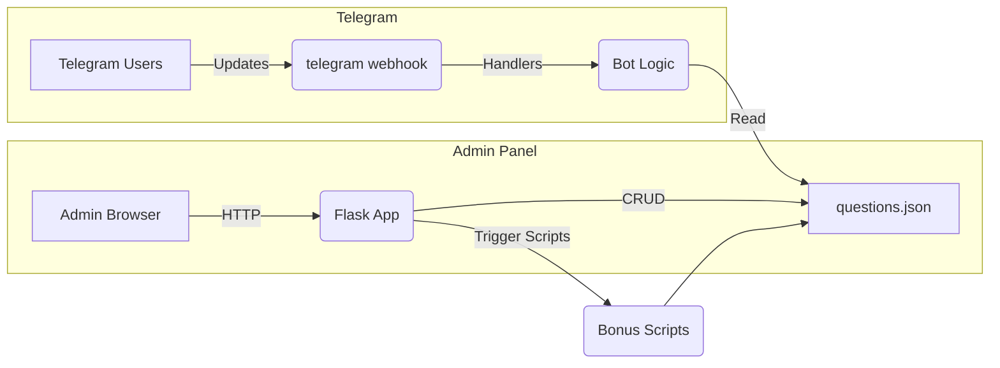

# Empire Bot

## Overview

Empire Bot is a Telegram quiz bot with an admin panel built on Flask. It allows managing quiz questions, answer buttons, and bonus logic from a web interface, while interacting with users on Telegram.

## Table of Contents

* [Overview](#overview)
* [Architecture](#architecture)
* [Directory Structure](#directory-structure)
* [Installation](#installation)
* [Configuration](#configuration)
* [Usage](#usage)
* [Testing](#testing)
* [CI/CD](#cicd)
* [Contributing](#contributing)

## Architecture

The architecture of Empire Bot consists of two main layers:

1. **Admin Panel (Flask Web App)**

   * **Framework**: [Flask](https://flask.palletsprojects.com/) for routing, views, and API endpoints.
   * **Templates**: Jinja2 templates (`templates/`) render HTML pages for question management, button configuration, and quiz blocks.
   * **Static Assets**: CSS and JavaScript under `static/` for styling and client-side interactivity.
   * **Controllers / Blueprints**:

     * **Auth Blueprint**: handles admin login/logout using session cookies.
     * **Questions Blueprint**: CRUD operations on quiz questions stored in JSON.
     * **Blocks Blueprint**: grouping of questions into quiz rounds or modules.
   * **Data Access**: Reads and writes `data/questions.json` atomically to prevent concurrent write issues.

2. **Telegram Bot (python-telegram-bot)**

   * **Bot Core**: defined in `bot.py`, uses [python-telegram-bot](https://python-telegram-bot.org/) library to receive updates.
   * **Handlers**:

     * **Command Handlers**: `/start`, `/help`, `/quiz`, etc.
     * **CallbackQuery Handlers**: process button presses for quiz answers.
     * **Error Handlers**: log and report exceptions.
   * **Bonus Scripts**: `add_bonus_*.py` utilities to award bonus points based on specific events or triggers.

### Interactions and Flow



* **CRUD Cycle**: Admin makes changes in the panel → Flask writes JSON → Bot reads updated JSON on next quiz.
* **Quiz Flow**: User interacts with bot → Bot queries JSON for questions → Bot sends buttons → User selects answer → Bot replies, records score.
* **Bonus Flow**: Periodic or event-driven scripts modify JSON/DB for bonus points.

## Directory Structure

```
├── app.py              # Flask application entrypoint
├── run_app.py          # Runner for Flask
├── bot.py              # Telegram bot logic
├── run_bot.py          # Runner for bot polling or webhook
├── add_bonus_daily.py  # Script to award daily bonuses
├── data/
│   └── questions.json  # JSON storage for questions and state
├── templates/          # Jinja2 HTML templates
│   ├── layout.html
│   ├── login.html
│   └── questions.html
├── static/             # CSS, JS assets
│   ├── css/
│   └── js/
├── tests/              # Pytest test files
│   ├── test_bot.py
│   └── test_env.py
└── requirements.txt    # Python dependencies
```

## Installation

1. **Clone the repo**:

   ```bash
   ```

git clone [https://github.com/aivasov/empire-bot.git](https://github.com/aivasov/empire-bot.git)
cd empire-bot

````
2. **Create env and install**:
   ```bash
python3 -m venv venv
source venv/bin/activate
pip install -r requirements.txt
````

3. **Configure** (see [Configuration](#configuration)).

## Configuration

Provide secrets and settings via environment variables in a `.env` file:

```ini
FLASK_SECRET_KEY=your_secret_key
ADMIN_PASSWORD=changeme
TELEGRAM_TOKEN=bot_token_here
```

## Usage

* **Start Admin Panel**:

  ```bash
  ```

python run\_app.py

````
- **Start Bot**:
  ```bash
python run_bot.py
````

* Admin at `http://localhost:5000`; Bot polling or webhook as configured.

## Testing

Run tests with pytest:

```bash
pytest
```

Ensure coverage for handlers and CRUD operations.

## CI/CD

A GitHub Actions workflow can be configured in `.github/workflows/ci.yml` to:

* Install dependencies
* Run linting (Black, Flake8)
* Run `pytest`
* (Optional) Deploy to server on new tags

## Contributing

1. Fork the repo
2. Create feature branch
3. Open a Pull Request

---

*Project by Alex Aivasov*
